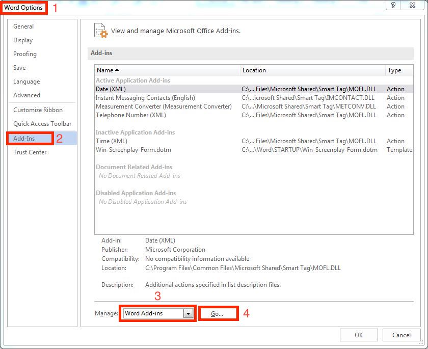
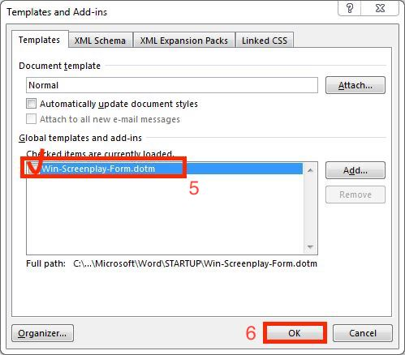
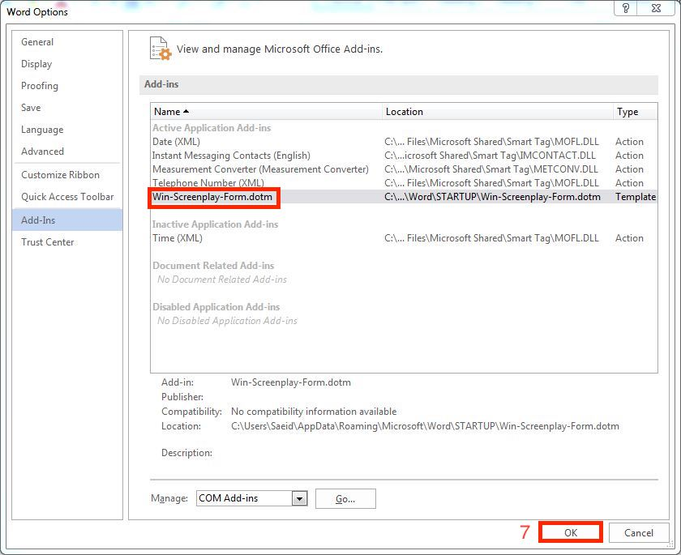

## Screenplay Form Tab For Word
<p align="center">
  
</p>

## Table of Contents
## 1. Introduction
🎬 This project introduces a custom ribbon tab for Microsoft Word, designed specifically for screenwriters. The tab provides quick access to essential formatting and structuring tools commonly used in scriptwriting. It includes options for adding scene titles, character names, parentheticals, and dialogue, making the scriptwriting process more efficient.

## 2. Installation
1. Open File Explorer and navigate to:
```
C:\Users\YourUsername\AppData\Roaming\Microsoft\Word\Startup
```
> [!NOTE]
>If the AppData folder is hidden, enable hidden items from the View tab in File Explorer.

2. Copy  ‌```Win-Screenplay-Form.dotm‌``` and  ‌```ScreenplayUI.exportedUI``` from the Files folder and paste it into the Startup folder.  

3. Restart Microsoft Word to apply the changes.

> [!NOTE]
>Required font: ‌```B Nazanin```

## 3. Enable Macros
### Step1:
<p>
  
</p>

### Step2:
<p>
  
</p>


## 4. Add In Word
### Step1:
<p>
  
</p>

### Step2:
<p>
  
</p>

### Step3:
<p>
  
</p>

## 5. Add Tab
### Step1:
<p>
  
</p>

> [!NOTE]
>Click import and add ‌```SreenplauUI.ExportedUI‌``` From Startup folder to word.
### Step2:
<p>
  
</p>

### Step3:
<p>
  
</p>

## 6.Usage
Check ```Training Tab.mp4``` in Usage folder .
## 8.LICENSE

