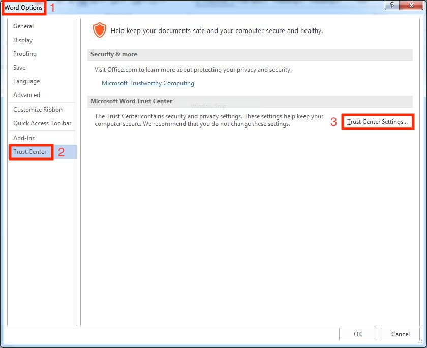
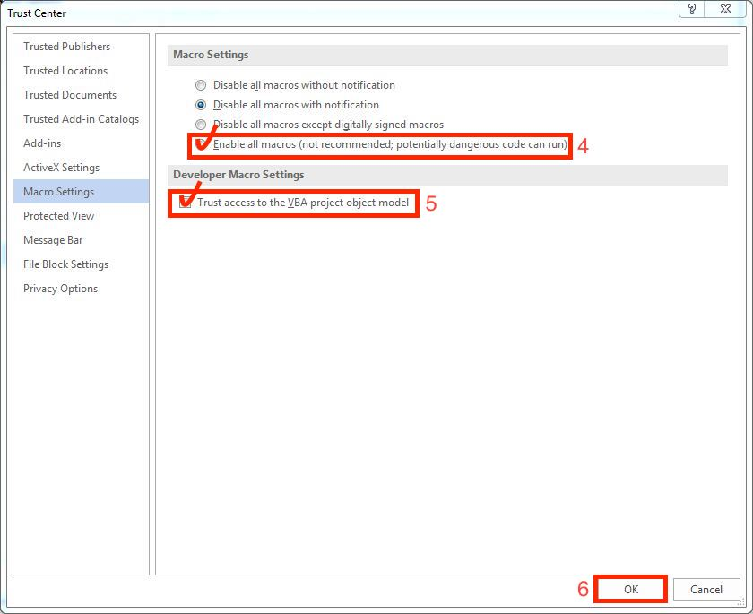
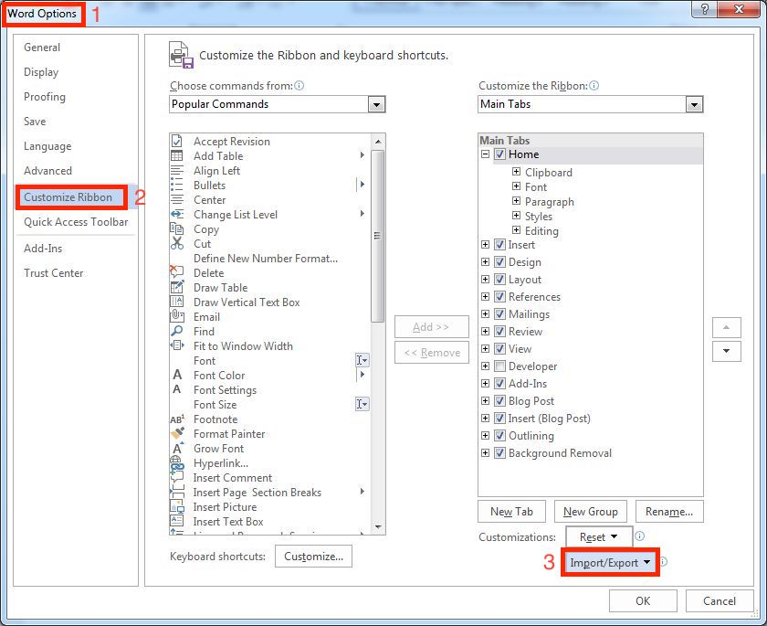
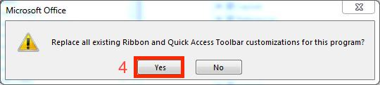
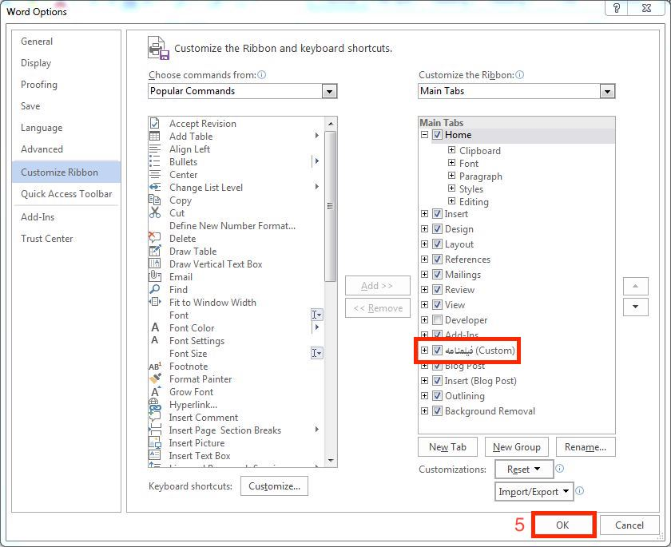

# 🎬 Screenplay Format Tab for Microsoft Word  

<p align="center">
  
</p>

This project introduces a custom **screenwriting tab** for **Microsoft Word**, making it easier for writers to format their scripts. With this tab, you can quickly apply standard screenplay formatting, including:  

- **Scene Headings**  
- **Character Names & Dialogue**  
- **Parentheticals & Transitions**  
- **Essential Scriptwriting Tools**  

## ✨ Features  

✔ **Scene Formatting** – Easily insert properly formatted scene headings.  
✔ **Character & Dialogue** – Quick shortcuts for character names and dialogue.  
✔ **Parentheticals & Actions** – Add scene descriptions, sound effects, and directions.  
✔ **Improved Workflow** – Streamline the scriptwriting process inside Microsoft Word.  

---

## 🎥 Usage Instructions  

For a step-by-step guide, watch the **tutorial video** located in the [`Usage`](./Usage) folder:  

📂 `Training Tab.mp4`  

The video covers:  
✔ How to enable and use the **Screenplay Format Tab**.  
✔ How to correctly format **scene headings, character names, and dialogue**.  
✔ Tips for optimizing your **screenwriting workflow** in Microsoft Word.  

---

## 🛠 Installation  

### 🔹 For Windows  

1️⃣ **Open the Startup folder**:  
   - Open **File Explorer** and navigate to:  
     ```
     C:\Users\YourUsername\AppData\Roaming\Microsoft\Word\Startup
     ```
   - If the `AppData` folder is hidden, enable **Hidden items** from the **View** tab in File Explorer.  

2️⃣ **Copy the required files**:  
   - Copy `Win-Screenplay-Form.dotm` and `ScreenplayUI.exportedUI` from the `Files` folder.  
   - Paste them into the `Startup` folder.  

3️⃣ **Restart Microsoft Word** to apply the changes.  

> **⚠ Note:** This project requires the `B Nazanin` font. Ensure it is installed on your system.  

---

## 🔐 Enabling Macros  

To enable macros in Microsoft Word:  

1️⃣ **Open Macro Settings**:  
   - Go to **File > Options > Trust Center**.  
   - Click on **Trust Center Settings...**  

2️⃣ **Change Macro Settings**:  
   - Under **Macro Settings**, select **Enable all macros**.  
   - Ensure that **Trust access to the VBA project object model** is checked.  

3️⃣ **Confirm and Close**:  
   - Click **OK** to save the changes and exit.  

> **⚠ Warning:** Enabling all macros can pose security risks. Ensure you only run macros from **trusted sources**.  

<p align="center">
  
</p>

<p align="center">
  
</p>

---

## ➕ Adding the Custom Tab to Word  

To add the **Screenplay Format Tab**:  

1️⃣ **Open Ribbon Settings**:  
   - Go to **File > Options > Customize Ribbon**.  

2️⃣ **Import the Tab Configuration**:  
   - Click **Import/Export** and select **Import customization file**.  
   - Choose the `ScreenplayUI.exportedUI` file copied to the `Startup` folder.  

3️⃣ **Confirm and Apply**:  
   - Click **OK** to apply the changes.  

<p align="center">
  
</p>

> **⚠ Note:** Click **Import** and select `ScreenplayUI.exportedUI` from the `Startup` folder.  

<p align="center">
  
</p>

<p align="center">
  
</p>

---

## 📜 License  

```plaintext
Copyright (c) 2025 Saeid Gozali  

This project is licensed under the **Creative Commons Attribution-NonCommercial-ShareAlike 4.0 International License (CC BY-NC-SA 4.0).**

You are free to:  
✅ **Share** – Copy and redistribute this project in any medium or format.  
✅ **Adapt** – Remix, transform, and build upon this project for non-commercial purposes.  

Under the following conditions:  
🔹 **Attribution** – You must give appropriate credit and indicate if changes were made.  
🔹 **Non-Commercial** – You may not use the material for commercial purposes.  
🔹 **ShareAlike** – If you modify or build upon this work, you must distribute your contributions under the same license.  

For more details, see: [Creative Commons License](https://creativecommons.org/licenses/by-nc-sa/4.0/)
