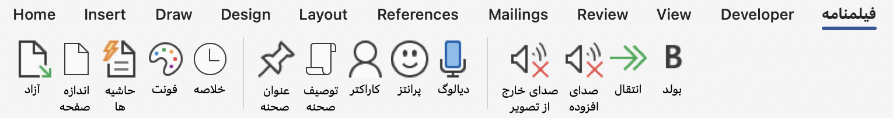
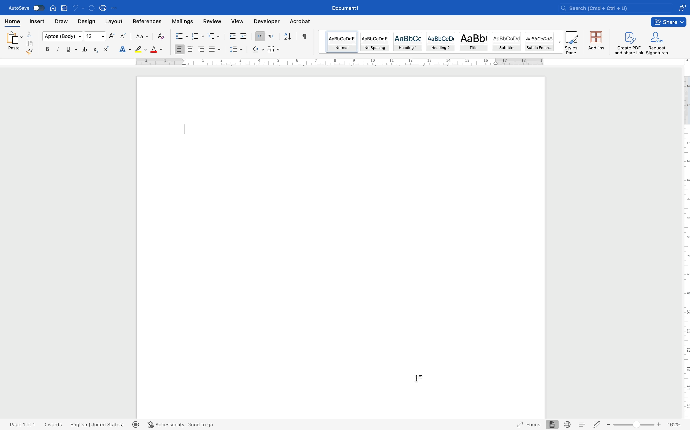

## Screenplay Format For Word
<p align="center">
  
</p>
## Table of Contents
1. [Introduction](#1-introduction)
2. [Model Summary](#2-model-summary)
3. [Model Downloads](#3-model-downloads)
4. [Evaluation Results](#4-evaluation-results)
5. [Chat Website & API Platform](#5-chat-website--api-platform)
6. [How to Run Locally](#6-how-to-run-locally)
7. [License](#7-license)
8. [Citation](#8-citation)
9. [Contact](#9-contact)

## 1. Introduction
🎬 This project introduces a custom ribbon tab for Microsoft Word, designed specifically for screenwriters. The tab provides quick access to essential formatting and structuring tools commonly used in scriptwriting. It includes options for adding scene titles, character names, parentheticals, and dialogue, making the scriptwriting process more efficient.

## 2. Installation
### For Mac
1. Open Finder and navigate to:
```
~/Library/Group Containers/UBF8T346G9.Office/User Content/Startup/Word/
```
> [!NOTE]
>If the Library folder is hidden, press Cmd + Shift + . (dot) to reveal it.  

2. Copy 'Mac-Format.dotm' from the 'Files' folder and paste it into the Word folder.  

3. Restart Microsoft Word to apply the changes.

### For Windows
1. Open File Explorer and navigate to:
```
C:\Users\YourUsername\AppData\Roaming\Microsoft\Word\Startup
```
> [!NOTE]
>If the AppData folder is hidden, enable hidden items from the View tab in File Explorer.

2. Copy Windows-Format.dotm from the Files folder and paste it into the Startup folder.  

3. Restart Microsoft Word to apply the changes.

## 3. Add In Word
### For Mac



### For Windows

## 4. Enable Macros
### For Mac
